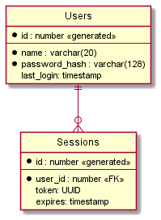
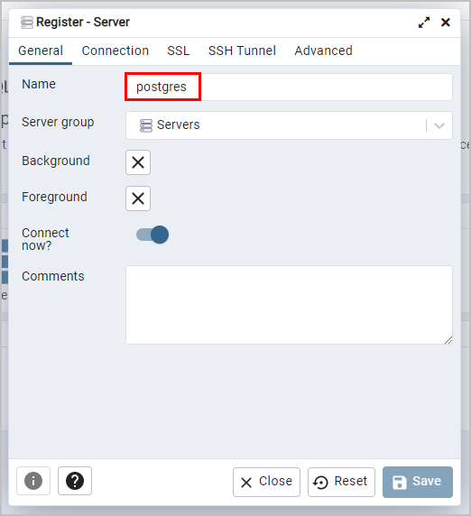
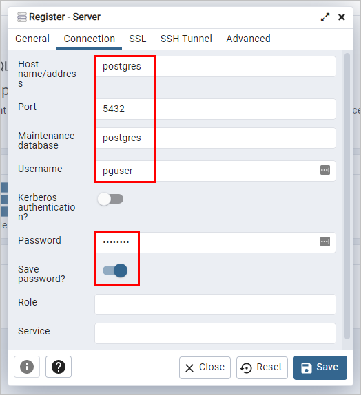

# Общие моменты

Делайте изменения в ветке `07_database`.

# Реализуйте авторизацию пользователей

Добавьте поддержку пользователей:

- для работы с пользователями следует использовать отдельный микросервис
- пользователи будут хранится в БД
- каждый пользователь будет авторизовываться по логину и паролю
- в БД будет хранится sha256 хэш от пароля (а не сам пароль)
- в БД будет хранится информация о сессиях



## Микросервис для работы с пользователями

- регистрация
- авторизация (проверка по логину и паролю)
- проверка токена (валидной авторизации)
- выход из системы

Check authorization for server methods
Add signup, signin and logout server methods

# Запуск БД через Docker Compose

В качестве БД рекомендуется использовать PostgreSQL, но окончательный выбор за вами.

Запустить локально БД можно с помощью Docker:

```console
$ cd db
$ docker compose up    # интерактивный режим
$ docker compose up -d # в фоновом режиме
```

В фоновом режиме можно посмотреть логи:

```console
$ docker compose logs
$ docker compose logs -f # с просмотром вживую, ^C - выход
```

Остановить БД (без удаления данных):

```console
$ docker compose stop
```

Оставить и удалить все данные:

```console
$ docker compose down -v
```

Подключение к запущенной БД:

- host: `localhost` (для python скриптов) и `postgres` (для pgAdmin)
- port: `5432`
- username: `pguser`
- password: `pgpasswd`

Подключение через pgAdmin:

- Откройте в браузере http://localhost:5050/
- Установите мастер-пароль при первом запуске
- Во вкладке `General`:
  - укажите имя подключения в поле `Name`



- Во вкладке `Connection`:
  - укажите имя подключения в поле `Name`



Подключение через psql (см. [документацию](https://www.postgresql.org/docs/current/app-psql.html) для параметров):

```console
$ docker exec -it postgres psql -d mydb -U myuser -W
Password: ********
psql (14.3 (Debian 14.3-1.pgdg110+1))
Type "help" for help.

mydb=#
```

# Создание БД

Откройте pgAdmin или `psql`.

Для схемы выше выполните следующий скрипт:

```sql
create table users (
  id uuid primary key,
  name varchar(50) not null,
  password char(64) not null, -- 32 bytes of sha256 in hex form (multiple by 2)
  last_login timestamp
);

create table sessions (
  id uuid primary key,
  user_id uuid references users(id),
  expires timestamp
);
```

# Запросы к БД

```sql

```


# Справочная информация

- https://docs.python.org/3/library/hashlib.html
- https://www.psycopg.org/docs/
